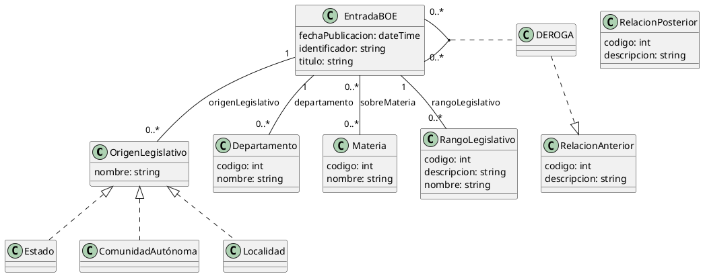

# Notas sobre la parte de ontologías

- EntradaBOE
    - identificador: str
    - titulo: str
    - departamento: Departamento
    - fecha_publicacion: date
    - rango: RangoLegislativo
    - materias: Materia
    - origen_legislativo: Estado, ComunidadAutonoma, Localidad

- Materia
    - codigo
    - nombre

- Departamento
    - codigo
    - nombre

- RangoLegislativo
    - codigo
    - descripcion

- RelacionPosterior
    - codigo
    - descripcion

- RelacionAnterior
    - codigo
    - descripcion

**Otras tuplas**
* EntradaBOE - RelacionPosterior concreta - EntradaBOE
* EntradaBOE - RelacionAnterior concreta - EntradaBOE

**Entidades externas**
ComunidadAutonoma: http://es.dbpedia.org/resource/Comunidad_autónoma
Provincia: http://es.dbpedia.org/resource/Provincia_(España)
Localidad: http://es.dbpedia.org/resource/Localidad
Estado: http://es.dbpedia.org/resource/Estado

## Notas de implementaciñon
- Además, creo que se le puede poner cardinalidad a los atributos
- Las referencias (anterior y posterior) pueden apuntar a entradas "DOUE", que no sé lo que son, pero hay que filtrarlas.

## Plantuml equivalente
